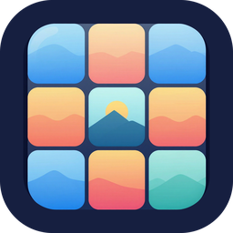

<p align="center"></p>

# Gallery

A simple photo and video gallery for **Android** and **Linux (ARM64 and x64)**.
It shows the media on the device and can also browse folders on **SFTP/SSH**,
**WebDAV** and **Seafile** servers.

## Features

- **Recent:** the newest photos and videos first, in a grid. The grid has 3
  columns by default; change it in *Settings* (2 to 8).
- **Folders menu:** the side menu lists the device folders.
  - Android: the classic albums (Camera, Screenshots, Screen recordings, Download,
    Pictures, Movies, WhatsApp, Telegram, Instagram). Every other folder Android
    found media in (app caches, stickers, game data) is under a collapsed
    *Other folders*, and stays out of *Recent*.
  - Linux: the XDG folders (Pictures, Screenshots, DCIM, Videos, Downloads, Desktop).
- **Remote folders:** add SFTP, WebDAV or Seafile locations from the menu. They
  are listed under *Remote folders*, and you can open their subfolders. Long-press
  one to edit or remove it.
- **Everything inside a folder:** long-press any folder (in the menu or in a
  folder's list) and pick *Show everything inside* to get one grid with the
  photos and videos of all its subfolders. It fills in while the subfolders are
  read, and the viewer swipes through all of it. On Android, where albums are
  flat, this means the folder plus every album below its path.
- **Formats:** JPEG, PNG, WebP, BMP, animated GIF, and MP4, MOV, WebM and MKV
  videos.
- **Lightweight:** the arm64 APK is about 10 MB. No video engine is bundled:
  Android plays videos with the system's ExoPlayer and Linux uses the system libmpv.
- **Full-screen viewer:**
  - Tap the left or right band, or swipe sideways, to go to the previous or next item.
  - Tap the center band, or swipe up or down, to close the viewer.
  - Pinch or double-tap to zoom.
  - On desktop, the mouse wheel or the arrow keys move between items, and Esc
    closes the viewer.

## Install

Download the latest build from [Releases](../../releases).

- **Android:** `gallery-android-arm64.apk` is the right file for most phones. There
  are also `armv7` and `universal` builds.
- **Linux:** download `gallery-linux-arm64.tar.gz` or `gallery-linux-x64.tar.gz` and run:

  ```sh
  sudo apt install libmpv2        # runtime dependency for video
  tar xzf gallery-linux-arm64.tar.gz
  ./gallery/gallery               # run it in place
  ./gallery/install.sh            # or install it to ~/.local with a menu entry
  ```

## Remote folders

| Type | Address | Notes |
|---|---|---|
| SFTP / SSH | host and port | Password or private key (PEM/OpenSSH; the password field is the passphrase). Host keys are not checked. |
| WebDAV | full folder URL, e.g. `https://cloud.example.com/remote.php/dav/files/me/Photos` | Basic auth. Works with Nextcloud, ownCloud, Apache and rclone. |
| Seafile | server URL, library name and folder | Uses the Web API v2. Grid previews come from the server's thumbnails. |

Files you open are downloaded to the app cache. You can clear the cache in *Settings*.

Credentials are stored in the app's private data folder, which on Linux is
`~/.local/share/com.jjolmo.gallery/remotes.json`, with `0600` permissions. Many
ARM boards have no system keyring, so the app doesn't use one.

## Build

You need Flutter 3.47 or later.

```sh
flutter pub get
flutter run -d linux        # needs clang, cmake, ninja, libgtk-3-dev and libmpv-dev
flutter build apk --release
```

Tests: `flutter test`. The live connector tests in `test_live/` need a WebDAV
server and an SFTP login (see the file).

CI ([`.github/workflows/build.yml`](.github/workflows/build.yml)) builds the
Android APKs and the Linux arm64 and x64 bundles on every push. Pushing a `v*` tag
publishes a release with all of them.

## License

MIT
